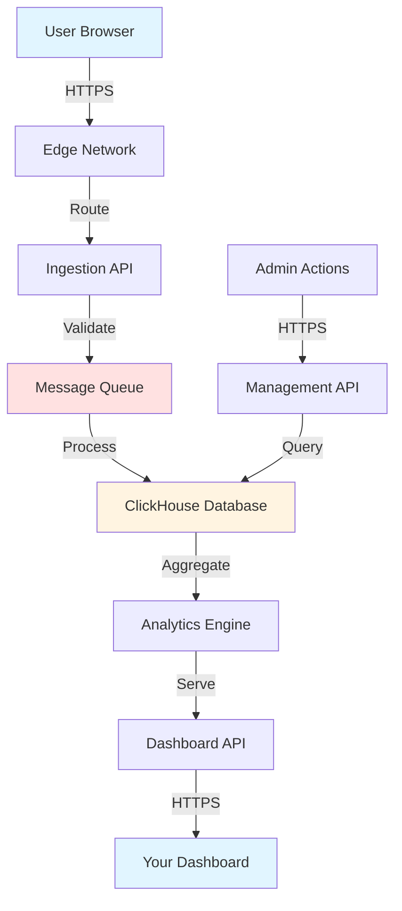
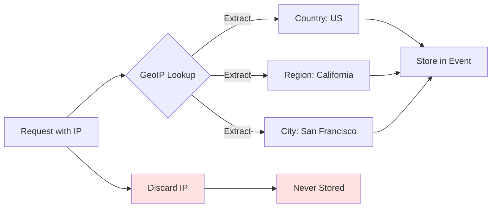

Databuddy processes all analytics data with enterprise-grade security and privacy protections. This page details our infrastructure, data flows, processing locations, and security measures.

## Data Processing Overview

### Processing Architecture



### Data Flow Stages

<Steps>
  <Step title="Collection">
    **Browser → Edge Network**
    
    - JavaScript tracker captures events
    - Data sent via HTTPS POST to `basket.databuddy.cc`
    - Request routed through global CDN for low latency
  </Step>
  
  <Step title="Ingestion">
    **Edge → Ingestion API**
    
    - Request validated and sanitized
    - IP address used for geo-lookup (country/region)
    - IP immediately discarded, never stored
    - Bot detection applied
  </Step>
  
  <Step title="Queuing">
    **Ingestion → Message Queue**
    
    - Events batched for efficiency
    - Processed via Redpanda/Kafka message queue
    - Ensures durability and scalability
  </Step>
  
  <Step title="Storage">
    **Queue → Database**
    
    - Events written to ClickHouse (columnar database)
    - Optimized for analytical queries
    - Anonymous data only
  </Step>
  
  <Step title="Aggregation">
    **Database → Analytics Engine**
    
    - Real-time and batch aggregations
    - Pre-computed statistics for dashboard
    - Historical trend analysis
  </Step>
  
  <Step title="Delivery">
    **Analytics → Dashboard**
    
    - API serves aggregated data
    - Authenticated access only
    - Real-time updates via WebSockets
  </Step>
</Steps>

## Processing Locations

### Primary Data Center

**United States (Primary)**
- Cloud provider: AWS / Google Cloud
- Regions: us-east, us-west
- SOC 2 Type II certified infrastructure
- 99.99% uptime SLA

### Edge Network

**Global CDN Distribution:**
- 50+ edge locations worldwide
- Cloudflare or similar CDN provider
- Routes traffic to nearest edge node
- Reduces latency for all users

**Edge locations include:**
- North America (USA, Canada)
- Europe (UK, Germany, France, Netherlands)
- Asia Pacific (Singapore, Japan, Australia)
- South America (Brazil)
- Middle East (UAE)

<Note>
**Privacy guarantee:** Data is collected at edge nodes but **all processing and storage** happens in primary data centers. Edge nodes only route traffic; they don't store analytics data.
</Note>

### Database Storage

**ClickHouse Database:**
- Columnar storage optimized for analytics
- Hosted in US data centers
- Encrypted at rest (AES-256)
- Daily backups with 30-day retention
- Geo-redundant storage

**Message Queue (Redpanda):**
- High-throughput event streaming
- Deployed in same region as database
- Temporary event buffer (minutes, not days)
- Ensures no data loss during spikes

Source: `rust/ingestion/src/producer.rs` shows Redpanda/Kafka producer implementation

## Data Processing Details

### Ingestion Pipeline

Implemented in Rust for performance and security:

```rust Ingestion Service (main.rs)
use axum::{
    http::{HeaderName, Method},
    routing::get,
    Router,
};

let cors = CorsLayer::new()
    .allow_origin(mirror_request())  // First-party only
    .allow_methods([POST, GET, OPTIONS])
    .allow_headers([
        "content-type",
        "databuddy-client-id",       // Client authentication
        "databuddy-sdk-name",         // SDK identification
        "databuddy-sdk-version",      // Version tracking
    ])
    .allow_credentials(true);
```

Source: `rust/ingestion/src/main.rs:1-48`

**Security measures:**
- Origin validation (CORS)
- Client ID verification
- Request size limits (prevents abuse)
- Rate limiting per client
- Bot detection

### IP Address Handling

<Warning>
**Critical Privacy Protection:** IP addresses are **never stored** in our database.
</Warning>

IP processing flow:



Documented in: `rust/ingestion/MIGRATION.mdx:29`

**GeoIP enrichment:**
1. Extract IP from request headers (`cf-connecting-ip`, `x-forwarded-for`, `x-real-ip`)
2. Perform GeoIP lookup to determine country, region, city
3. Add geographic data to event payload
4. **Immediately discard IP address** - not written to database
5. Store only: `{"country": "United States", "region": "California"}`

**Why this is GDPR compliant:**
- IP addresses can be personal data under GDPR
- We use IP only for immediate geo-enrichment
- IP is not stored, cannot be retrieved
- Only aggregate country/region stored (not personal data)

### Data Validation & Sanitization

All incoming data is validated before processing:

```typescript Validation Schema Example
import { z } from "zod";

const analyticsEventSchema = z.object({
  event_type: z.enum(["page_view", "custom", "error"]),
  anonymous_id: z.string().uuid(),
  session_id: z.string().uuid(),
  timestamp: z.number().int().positive(),
  path: z.string().max(2048),  // URL length limit
  title: z.string().max(500).optional(),
  properties: z.record(z.unknown()).optional(),
});

// Validation happens at ingestion
const result = analyticsEventSchema.safeParse(incomingData);
if (!result.success) {
  return { error: "Invalid event data", details: result.error };
}
```

Source: `packages/validation/src/schemas/analytics.ts`

**Protections:**
- Type validation (correct data types)
- Length limits (prevent large payloads)
- Schema enforcement (reject malformed data)
- XSS prevention (sanitize strings)
- SQL injection prevention (parameterized queries)

### Bot Detection

Automated traffic filtering:

```typescript Bot Detection (tracker.ts:112-130)
detectBot(): boolean {
  if (this.isServer() || this.options.ignoreBotDetection) {
    return false;
  }

  const ua = navigator.userAgent || "";
  const isHeadless = /\bHeadlessChrome\b|\bPhantomJS\b/i.test(ua);

  return Boolean(
    navigator.webdriver ||          // Selenium, WebDriver
    window.webdriver ||             // Alternative webdriver check
    isHeadless ||                   // Headless browsers
    window.callPhantom ||           // PhantomJS
    window._phantom ||              // PhantomJS alternative
    window.selenium ||              // Selenium
    document.documentElement.getAttribute("webdriver") === "true"
  );
}
```

Source: `packages/tracker/src/core/tracker.ts:112-130`

**Additional bot detection:**
- User-agent analysis (server-side)
- Known bot IP ranges
- Behavioral patterns (no mouse movement, instant clicks)
- Request rate anomalies

Source: `packages/shared/src/utils/bot-detection/detector.ts`

### Batching & Performance

Events are batched to reduce network overhead:

```typescript Event Batching (tracker.ts:351-363)
addToBatch(event: BaseEvent): Promise<void> {
  this.batchQueue.push(event);
  
  if (this.batchTimer === null) {
    this.batchTimer = setTimeout(
      () => this.flushBatch(),
      this.options.batchTimeout  // Default: 5000ms
    );
  }
  
  if (this.batchQueue.length >= (this.options.batchSize || 10)) {
    this.flushBatch();  // Flush early if batch full
  }
  
  return Promise.resolve();
}
```

Source: `packages/tracker/src/core/tracker.ts:351-363`

**Batching benefits:**
- Reduces network requests (10 events → 1 request)
- Improves performance (less overhead)
- Better reliability (automatic retries)
- Lower costs (fewer serverless invocations)

**Batch settings:**
- Default batch size: 10 events
- Default timeout: 5 seconds
- Configurable per website

## Data Storage

### Database Technology

**ClickHouse (Columnar Database)**

<Tabs>
  <Tab title="Why ClickHouse?">
    - **Speed:** 100-1000x faster than traditional databases for analytics
    - **Compression:** 10x better data compression (lower storage costs)
    - **Scalability:** Handles billions of events
    - **Real-time:** Sub-second query response times
    - **Cost-effective:** Optimized for analytical workloads
  </Tab>
  
  <Tab title="Data Organization">
    **Tables:**
    - `events` - Raw page views, clicks, custom events
    - `sessions` - Session metadata and aggregations
    - `web_vitals` - Performance metrics (LCP, FID, CLS, etc.)
    - `errors` - JavaScript error tracking
    - `daily_stats` - Pre-aggregated daily statistics
    
    **Partitioning:**
    - By date (for efficient retention policy enforcement)
    - By website_id (for data isolation)
  </Tab>
  
  <Tab title="Query Optimization">
    **Materialized views:**
    - Real-time aggregations
    - Top pages, referrers, countries
    - Conversion funnels
    - Retention cohorts
    
    **Indexes:**
    - Primary key: (website_id, timestamp, event_id)
    - Secondary indexes on common filters
    - Bloom filters for string columns
  </Tab>
</Tabs>

### Encryption

**At Rest:**
- AES-256 encryption for all stored data
- Encrypted database volumes
- Encrypted backups
- Key rotation every 90 days

**In Transit:**
- TLS 1.3 for all connections
- HTTPS only (no HTTP)
- Certificate pinning
- Perfect forward secrecy

```typescript HTTPS-Only Client (client.ts:68-76)
const fetchOptions: RequestInit = {
  method: "POST",
  headers: await this.resolveHeaders(),
  body: JSON.stringify(data ?? {}),
  keepalive: true,
  credentials: "omit",
  ...options,
};

// All requests to https://basket.databuddy.cc (TLS enforced)
```

Source: `packages/tracker/src/core/client.ts:68-76`

### Backup & Recovery

**Automated Backups:**
- Daily full backups
- Hourly incremental backups
- 30-day backup retention
- Geo-redundant storage (multiple regions)

**Disaster Recovery:**
- RPO (Recovery Point Objective): 1 hour
- RTO (Recovery Time Objective): 4 hours
- Regular disaster recovery drills
- Documented recovery procedures

## Data Access Controls

### Authentication

Multi-layered authentication:

<Tabs>
  <Tab title="API Keys">
    ```bash
    curl https://api.databuddy.cc/v1/websites \
      -H "Authorization: Bearer db_key_a7f3d9c2..."
    ```
    
    - Scoped to specific websites
    - Read-only or read-write permissions
    - Revocable anytime
    - Expire after inactivity
  </Tab>
  
  <Tab title="Session Cookies">
    Dashboard authentication uses secure session cookies:
    
    - HttpOnly (JavaScript cannot access)
    - Secure (HTTPS only)
    - SameSite=Strict (CSRF protection)
    - 7-day expiration
    
    Source: `packages/auth/src/auth.ts:145-150`
  </Tab>
  
  <Tab title="OAuth / SSO">
    Enterprise customers can use:
    
    - Google OAuth
    - GitHub OAuth  
    - SAML 2.0 (enterprise)
    - Custom identity providers
  </Tab>
</Tabs>

### Authorization

**Role-Based Access Control (RBAC):**

| Role | Permissions |
|------|------------|
| **Owner** | Full access, billing, user management |
| **Admin** | Manage settings, view all data, manage team |
| **Member** | View analytics, create reports |
| **Viewer** | Read-only access to dashboards |
| **API** | Programmatic access (scope-limited) |

**Data Isolation:**
- Each website has a unique `website_id`
- All queries filtered by `website_id`
- Cross-website access impossible
- Tenant isolation enforced at database level

### Audit Logging

All sensitive actions are logged:

```json Audit Log Example
{
  "event_id": "audit_a7f3d9c2...",
  "timestamp": "2024-03-01T15:30:00Z",
  "user_id": "user_b8e4f1a3...",
  "action": "data_export",
  "resource": "website_123",
  "ip_address": "192.168.1.1",
  "user_agent": "Mozilla/5.0...",
  "result": "success"
}
```

**Logged actions:**
- Data exports
- User management changes
- API key creation/revocation
- Settings modifications
- Data deletions
- Login attempts (success and failure)

## Security Measures

### Infrastructure Security

<CardGroup cols={2}>
  <Card title="DDoS Protection" icon="shield">
    - Cloudflare DDoS mitigation
    - Rate limiting per IP
    - Request size limits
    - Bot challenge for suspicious traffic
  </Card>
  
  <Card title="Network Security" icon="network-wired">
    - Private VPC network
    - Firewall rules (allow-list only)
    - No public database access
    - VPN required for admin access
  </Card>
  
  <Card title="Application Security" icon="code">
    - Input validation on all endpoints
    - Parameterized queries (no SQL injection)
    - XSS prevention (output encoding)
    - CSRF tokens on forms
  </Card>
  
  <Card title="Monitoring" icon="radar">
    - 24/7 security monitoring
    - Intrusion detection system
    - Anomaly detection
    - Automated alerting
  </Card>
</CardGroup>

### Compliance Certifications

<AccordionGroup>
  <Accordion title="SOC 2 Type II">
    **Status:** In progress (expected 2024)
    
    Annual third-party audit of:
    - Security controls
    - Availability guarantees  
    - Processing integrity
    - Confidentiality measures
    - Privacy protections
  </Accordion>
  
  <Accordion title="GDPR">
    **Status:** Compliant by design
    
    - Privacy by design and default
    - Data minimization
    - Purpose limitation
    - Storage limitation (configurable retention)
    - Data subject rights (opt-out, deletion)
  </Accordion>
  
  <Accordion title="ISO 27001">
    **Status:** Planned (2025)
    
    Information security management system certification.
  </Accordion>
</AccordionGroup>

### Penetration Testing

- Annual third-party penetration tests
- Continuous security scanning
- Bug bounty program (coming soon)
- Vulnerability disclosure policy

## Data Processing Agreements

### GDPR Data Processing Agreement (DPA)

For EU customers, Databuddy can provide a DPA that covers:

- Roles and responsibilities (controller vs processor)
- Processing instructions
- Data security measures
- Sub-processor disclosure
- Cross-border data transfers (if applicable)
- Data subject rights assistance
- Breach notification procedures

<Note>
**Important:** Because Databuddy only processes **anonymous data** (not personal data under GDPR), a DPA is often not legally required. However, we provide one upon request for your compliance documentation.
</Note>

### Standard Contractual Clauses (SCCs)

If your organization requires SCCs for cross-border data transfers:

- Available for EU → US data flows
- Compliant with Schrems II decision
- Includes transfer impact assessment
- Updated to 2021 European Commission SCCs

## Regional Data Processing

### Europe (EU/EEA)

**Current setup:**
- Data collected in EU is processed in US data centers
- IP addresses discarded immediately (no personal data transfer)
- Only anonymous event data transferred
- GDPR compliant under anonymous data exception

**Future plans:**
- EU-only data residency option (2024)
- Dedicated EU data centers (Germany/Ireland)
- Zero data transfer outside EU (optional)

### United Kingdom

- UK GDPR compliant
- Data processed in US (same as EU)
- UK DPA available upon request
- Adequacy decision ensures lawful transfers

### California (CCPA/CPRA)

- Anonymous data not subject to CCPA
- No "sale" of personal information
- Consumer rights not applicable (no personal data)
- Privacy policy disclosure recommended

### Other Regions

- Brazil (LGPD): Compliant under anonymous data provisions
- Canada (PIPEDA): Compliant
- Australia (Privacy Act): Compliant
- Asia-Pacific: Varies by jurisdiction, generally compliant

## Third-Party Services

Databuddy uses minimal third-party services:

| Service | Purpose | Data Shared | Location |
|---------|---------|-------------|----------|
| **Cloudflare** | CDN, DDoS protection | Request metadata (IP, headers) | Global |
| **AWS/GCP** | Infrastructure hosting | Encrypted data at rest | US |
| **Stripe** | Billing (dashboard only) | Payment info (PCI compliant) | US |
| **Resend** | Transactional emails | Email addresses | US |

**Analytics data is NEVER shared with:**
- Advertising networks
- Data brokers
- Marketing platforms
- AI training datasets
- Any third party without your explicit consent

## Transparency & Trust

### Open Source Components

Parts of Databuddy are open source:

- JavaScript tracker (client SDK)
- Validation schemas
- Public API specifications

**GitHub:** [github.com/databuddy](https://github.com/databuddy) (example)

### Status Page

Real-time service status:

- Uptime monitoring
- Incident history
- Scheduled maintenance
- Performance metrics

**URL:** status.databuddy.cc (example)

### Privacy-First Guarantees

<Check>**We will never sell your data**</Check>
<Check>**We will never share data with advertisers**</Check>
<Check>**We will never use your data for AI training**</Check>
<Check>**We will never change our privacy model**</Check>

These guarantees are contractual and cannot be changed without your consent.

## Frequently Asked Questions

<AccordionGroup>
  <Accordion title="Where is my data physically stored?">
    Primary storage is in **US data centers** (AWS/GCP). Data is encrypted at rest and backed up to geo-redundant storage. EU-only storage will be available in 2024.
  </Accordion>

  <Accordion title="Can I request EU-only data processing?">
    **Coming 2024.** We're building dedicated EU infrastructure for customers who require data residency in the EU. Contact sales for early access.
  </Accordion>

  <Accordion title="Do you use sub-processors?">
    Yes, minimal sub-processors:
    - Cloudflare (CDN/DDoS)
    - AWS/GCP (infrastructure)
    - Stripe (payments - dashboard only)
    
    Full list available in our DPA.
  </Accordion>

  <Accordion title="How do you handle cross-border data transfers?">
    Since we only process **anonymous data** (not personal data under GDPR), cross-border restrictions don't apply. However, we can provide SCCs upon request for compliance documentation.
  </Accordion>

  <Accordion title="What happens to my data if I cancel?">
    Upon account cancellation:
    - Data retained for 30 days (recovery period)
    - Automatic deletion after 30 days
    - Immediate deletion available upon request
    - Export your data before cancellation
  </Accordion>

  <Accordion title="Can I export all my data?">
    Yes. Use the dashboard export feature or API to download:
    - Raw events (CSV, JSON, Parquet)
    - Aggregated statistics  
    - Custom reports
    
    No limits on export size or frequency.
  </Accordion>

  <Accordion title="How do you ensure data isolation between customers?">
    - Unique `website_id` per customer
    - Database-level tenant isolation
    - All queries filtered by `website_id`
    - Regular security audits
    - Penetration testing
  </Accordion>
</AccordionGroup>

## Contact & Support

### Data Processing Questions

**Privacy team:** [privacy@databuddy.cc](mailto:privacy@databuddy.cc)

**Security team:** [security@databuddy.cc](mailto:security@databuddy.cc)

**DPA requests:** [legal@databuddy.cc](mailto:legal@databuddy.cc)

### Security Disclosure

Found a security vulnerability?

**Report to:** [security@databuddy.cc](mailto:security@databuddy.cc)

- Responsible disclosure appreciated
- 90-day disclosure timeline
- Acknowledgment in security hall of fame
- Bug bounty program (coming soon)

## Next Steps

<CardGroup cols={2}>
  <Card title="GDPR Compliance" icon="shield-check" href="/privacy/gdpr-compliance">
    Understand GDPR compliance by default
  </Card>
  
  <Card title="Data Retention" icon="database" href="/privacy/data-retention">
    Configure retention policies
  </Card>
  
  <Card title="Cookie Policy" icon="cookie-bite" href="/privacy/cookie-policy">
    Learn about our cookieless approach
  </Card>
  
  <Card title="API Reference" icon="code" href="/api-reference/introduction">
    Access data programmatically
  </Card>
</CardGroup>
