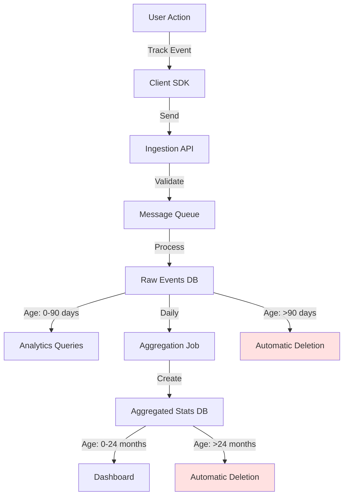

Databuddy provides flexible data retention policies that balance analytical value with privacy and cost efficiency. All data stored is **anonymous by design**, containing no personal information.

## What Data is Stored

### Event Data

Every interaction tracked by Databuddy creates an event record:

```json Event Record Example
{
  "event_id": "evt_a7f3d9c2...",
  "event_type": "page_view",
  "website_id": "site_123",
  "anonymous_id": "anon_b8e4f1a3...",
  "session_id": "sess_c9f5e2b4...",
  "timestamp": 1709280000000,
  "path": "/pricing",
  "title": "Pricing - Databuddy",
  "referrer": "https://google.com",
  "viewport": "1920x1080",
  "language": "en-US",
  "timezone": "America/New_York",
  "country": "United States",
  "region": "California"
}
```

**What's NOT stored:**
- Full IP addresses (discarded after geo-lookup)
- Personal identifiable information (names, emails, etc.)
- Persistent cross-site identifiers
- Device fingerprints

### Session Data

Sessions are logical groupings of events within a 30-minute window:

```json Session Record Example
{
  "session_id": "sess_c9f5e2b4...",
  "website_id": "site_123",
  "anonymous_id": "anon_b8e4f1a3...",
  "start_time": 1709280000000,
  "last_activity": 1709281800000,
  "page_count": 5,
  "duration_seconds": 1800,
  "entry_page": "/",
  "exit_page": "/pricing",
  "utm_source": "google",
  "utm_campaign": "spring_2024",
  "country": "United States"
}
```

Sessions automatically expire after 30 minutes of inactivity:

```typescript Session Expiry Logic (tracker.ts:184-195)
const storedId = sessionStorage.getItem("did_session");
const sessionTimestamp = sessionStorage.getItem("did_session_timestamp");

if (storedId && sessionTimestamp) {
  const sessionAge = Date.now() - parseInt(sessionTimestamp, 10);
  if (sessionAge < 30 * 60 * 1000) {  // 30 minutes
    sessionStorage.setItem("did_session_timestamp", Date.now().toString());
    return storedId;
  }
  // Session expired - clean up
  sessionStorage.removeItem("did_session");
  sessionStorage.removeItem("did_session_timestamp");
  sessionStorage.removeItem("did_session_start");
}
```

### Performance Metrics

Web vitals and performance data:

```json Performance Record Example
{
  "metric_type": "CLS",
  "value": 0.05,
  "website_id": "site_123",
  "page": "/dashboard",
  "timestamp": 1709280000000,
  "session_id": "sess_c9f5e2b4..."
}
```

**Metrics tracked:**
- Core Web Vitals (LCP, FID, CLS, TTFB, FCP, INP)
- Page load times
- Time to interactive
- Resource loading performance

### Custom Events

User-defined tracking events:

```json Custom Event Example
{
  "event_id": "evt_d1a6e3f7...",
  "event_type": "custom",
  "name": "signup_completed",
  "website_id": "site_123",
  "anonymous_id": "anon_b8e4f1a3...",
  "session_id": "sess_c9f5e2b4...",
  "timestamp": 1709280000000,
  "properties": {
    "plan": "pro",
    "trial_days": 14,
    "source": "landing_page"
  }
}
```

### Aggregated Statistics

Pre-computed aggregations for dashboard performance:

```json Daily Aggregation Example
{
  "date": "2024-03-01",
  "website_id": "site_123",
  "page": "/pricing",
  "total_views": 1247,
  "unique_visitors": 892,
  "avg_duration_seconds": 45,
  "bounce_rate": 0.35,
  "top_referrers": [
    {"source": "google.com", "count": 423},
    {"source": "direct", "count": 312}
  ]
}
```

## Retention Policies

### Default Retention Periods

<CardGroup cols={2}>
  <Card title="Raw Events" icon="database">
    **90 days** (configurable)
    
    Individual page views, clicks, and interactions
  </Card>
  
  <Card title="Aggregated Data" icon="chart-line">
    **24 months** (configurable)
    
    Daily/weekly/monthly statistics and trends
  </Card>
  
  <Card title="Session Data" icon="clock">
    **90 days** (configurable)
    
    Session metadata and journey information
  </Card>
  
  <Card title="Performance Metrics" icon="gauge">
    **90 days** (configurable)
    
    Web vitals and performance measurements
  </Card>
</CardGroup>

### Configurable Retention

You can customize retention periods for your website:

<Steps>
  <Step title="Navigate to Settings">
    Go to **Website Settings → Data Management → Retention Policy**
  </Step>
  
  <Step title="Choose Retention Period">
    Select from preset options:
    - 30 days (minimal retention)
    - 90 days (default)
    - 180 days (6 months)
    - 365 days (1 year)
    - 730 days (2 years)
    - Custom period
  </Step>
  
  <Step title="Configure by Data Type">
    Set different retention for:
    - Raw events
    - Aggregated statistics  
    - Performance metrics
    - Custom events
  </Step>
  
  <Step title="Apply Changes">
    Changes take effect within 24 hours. Existing data is not affected retroactively.
  </Step>
</Steps>

<Note>
**Best Practice:** Retain raw events for 90 days for detailed analysis, and aggregated data for longer periods for trend analysis. This balances analytical value with storage costs and privacy.
</Note>

### Automatic Data Deletion

Databuddy automatically deletes data older than your retention period:

<Tabs>
  <Tab title="Daily Cleanup Process">
    ```sql Automated Deletion Query (conceptual)
    -- Runs daily at 00:00 UTC
    DELETE FROM events 
    WHERE timestamp < NOW() - INTERVAL '90 days'
      AND website_id = 'site_123';
    
    DELETE FROM sessions
    WHERE start_time < NOW() - INTERVAL '90 days'
      AND website_id = 'site_123';
    
    DELETE FROM web_vitals
    WHERE timestamp < NOW() - INTERVAL '90 days'
      AND website_id = 'site_123';
    ```
  </Tab>
  
  <Tab title="Aggregation Before Deletion">
    Before deleting raw events, data is aggregated:
    
    ```sql Aggregation Process (conceptual)
    -- Create daily aggregates before deleting raw events
    INSERT INTO daily_statistics
    SELECT 
      DATE(timestamp) as date,
      website_id,
      page,
      COUNT(*) as total_views,
      COUNT(DISTINCT anonymous_id) as unique_visitors,
      AVG(duration_seconds) as avg_duration
    FROM events
    WHERE DATE(timestamp) = CURRENT_DATE - INTERVAL '90 days'
    GROUP BY DATE(timestamp), website_id, page;
    
    -- Then delete raw events
    DELETE FROM events
    WHERE DATE(timestamp) = CURRENT_DATE - INTERVAL '90 days';
    ```
  </Tab>
</Tabs>

## Data Lifecycle

### Event Processing Pipeline



### Timeline Example

<Timeline>
  <TimelineItem title="Day 0" icon="circle-play">
    Event captured and stored in raw events database
  </TimelineItem>
  
  <TimelineItem title="Day 1" icon="chart-simple">
    Event included in daily aggregation (stats, trends, reports)
  </TimelineItem>
  
  <TimelineItem title="Day 7" icon="chart-line">
    Event included in weekly aggregation
  </TimelineItem>
  
  <TimelineItem title="Day 30" icon="calendar">
    Event included in monthly aggregation
  </TimelineItem>
  
  <TimelineItem title="Day 90" icon="trash">
    Raw event deleted (default retention)
    
    Aggregated statistics remain available
  </TimelineItem>
  
  <TimelineItem title="Day 730" icon="trash-can">
    Aggregated statistics deleted (24-month retention)
    
    All data removed from system
  </TimelineItem>
</Timeline>

## Manual Data Deletion

### Delete Website Data

You can manually delete all analytics data for your website:

<Steps>
  <Step title="Navigate to Data Management">
    Go to **Website Settings → Data Management → Delete Data**
  </Step>
  
  <Step title="Choose Deletion Scope">
    Select what to delete:
    - **All data** - Complete removal of all analytics
    - **Date range** - Delete data between specific dates
    - **Data type** - Delete only events, sessions, or metrics
  </Step>
  
  <Step title="Confirm Deletion">
    Type your website domain to confirm
    
    This action is **irreversible**
  </Step>
  
  <Step title="Processing">
    Deletion typically completes within minutes for small datasets, up to hours for large datasets (millions of events)
  </Step>
</Steps>

<Warning>
**Irreversible Action:** Deleted data cannot be recovered. Make sure you have exported any data you need before deletion.
</Warning>

### Delete Specific Time Ranges

Delete data for a specific period:

```bash API Example
curl -X DELETE https://api.databuddy.cc/v1/websites/{website_id}/data \
  -H "Authorization: Bearer YOUR_API_KEY" \
  -H "Content-Type: application/json" \
  -d '{
    "start_date": "2024-01-01",
    "end_date": "2024-01-31",
    "data_types": ["events", "sessions"]
  }'
```

**Response:**
```json
{
  "success": true,
  "deleted": {
    "events": 45382,
    "sessions": 12043
  },
  "deletion_id": "del_a7f3d9c2...",
  "status": "processing"
}
```

### Export Before Deletion

Always export data before manual deletion:

```bash Export Data API
curl -X POST https://api.databuddy.cc/v1/websites/{website_id}/export \
  -H "Authorization: Bearer YOUR_API_KEY" \
  -H "Content-Type: application/json" \
  -d '{
    "start_date": "2024-01-01",
    "end_date": "2024-03-31",
    "format": "csv",
    "data_types": ["events", "sessions", "aggregated"]
  }'
```

**Response:**
```json
{
  "success": true,
  "export_id": "exp_b8e4f1a3...",
  "status": "processing",
  "estimated_completion": "2024-03-01T15:30:00Z",
  "download_url": null
}
```

Check export status:

```bash
curl https://api.databuddy.cc/v1/exports/{export_id} \
  -H "Authorization: Bearer YOUR_API_KEY"
```

When complete, you'll receive a download URL valid for 7 days.

## Client-Side Data Deletion

### Clear Anonymous ID

Users can clear their anonymous identifier at any time:

```javascript Clear Local Data
// Remove anonymous ID
localStorage.removeItem("did");

// Remove session data
sessionStorage.removeItem("did_session");
sessionStorage.removeItem("did_session_timestamp");
sessionStorage.removeItem("did_session_start");
```

Implemented in source: `packages/tracker/src/index.ts:333-336`

### Complete Opt-Out

Disable all tracking permanently:

```javascript Opt Out Function
function optOutOfAnalytics() {
  // Set opt-out flags
  localStorage.setItem("databuddy_opt_out", "true");
  localStorage.setItem("databuddy_disabled", "true");
  
  // Clear existing data
  localStorage.removeItem("did");
  sessionStorage.removeItem("did_session");
  
  // Set global flag
  window.databuddyOptedOut = true;
  
  console.log("Analytics disabled. Reload page for changes to take effect.");
}
```

Implemented in source: `packages/tracker/src/index.ts:404-405`

The tracker respects opt-out on every request:

```typescript Opt-Out Check (utils.ts:47-48)
export function isOptedOut(): boolean {
  return (
    localStorage.getItem("databuddy_opt_out") === "true" ||
    localStorage.getItem("databuddy_disabled") === "true" ||
    window.databuddyOptedOut === true
  );
}
```

### Privacy Controls Component

```tsx components/PrivacyControls.tsx
"use client";
import { useState, useEffect } from "react";

export function PrivacyControls() {
  const [hasData, setHasData] = useState(false);
  const [optedOut, setOptedOut] = useState(false);

  useEffect(() => {
    setHasData(!!localStorage.getItem("did"));
    setOptedOut(localStorage.getItem("databuddy_opt_out") === "true");
  }, []);

  const clearAllData = () => {
    // Clear anonymous ID
    localStorage.removeItem("did");
    sessionStorage.removeItem("did_session");
    sessionStorage.removeItem("did_session_timestamp");
    sessionStorage.removeItem("did_session_start");
    
    setHasData(false);
    alert("All local analytics data has been cleared.");
  };

  const toggleOptOut = () => {
    if (optedOut) {
      // Opt back in
      localStorage.removeItem("databuddy_opt_out");
      localStorage.removeItem("databuddy_disabled");
      setOptedOut(false);
    } else {
      // Opt out
      if (typeof window.databuddyOptOut === "function") {
        window.databuddyOptOut();
      } else {
        localStorage.setItem("databuddy_opt_out", "true");
        localStorage.setItem("databuddy_disabled", "true");
      }
      setOptedOut(true);
    }
  };

  return (
    <div className="space-y-4">
      <div>
        <h3 className="font-semibold">Your Analytics Data</h3>
        <p className="text-sm text-gray-600">
          {hasData 
            ? "You have an anonymous ID stored locally." 
            : "No analytics data stored."}
        </p>
      </div>

      <div className="flex gap-2">
        <button 
          onClick={clearAllData}
          disabled={!hasData}
          className="px-4 py-2 bg-gray-200 rounded disabled:opacity-50"
        >
          Clear Local Data
        </button>
        
        <button
          onClick={toggleOptOut}
          className="px-4 py-2 bg-blue-500 text-white rounded"
        >
          {optedOut ? "Enable Analytics" : "Disable Analytics"}
        </button>
      </div>

      <div className="text-xs text-gray-500">
        <p>Note: All data is anonymous and cannot identify you personally.</p>
      </div>
    </div>
  );
}
```

## Storage & Costs

### Storage Estimation

Typical storage per event:

```
Event Record: ~500 bytes
Session Record: ~300 bytes
Metric Record: ~200 bytes
Aggregation Record: ~1 KB
```

**Monthly storage for 100,000 page views:**
- Raw events: 100,000 × 500 bytes = 50 MB
- Sessions (~5 pages/session): 20,000 × 300 bytes = 6 MB
- Daily aggregations: 30 × 1 KB = 30 KB
- **Total: ~56 MB/month**

**Annual storage (90-day raw, 24-month aggregated):**
- Raw events (3 months): 56 MB × 3 = 168 MB
- Aggregations (24 months): 30 KB × 730 = 22 MB
- **Total: ~190 MB/year**

### Retention Impact on Storage

<Tabs>
  <Tab title="30 Days Retention">
    **Storage:** 56 MB/month × 1 = **56 MB**
    
    **Use case:** Minimal compliance requirements, cost-sensitive applications
    
    **Limitation:** No long-term trend analysis
  </Tab>
  
  <Tab title="90 Days Retention (Default)">
    **Storage:** 56 MB/month × 3 = **168 MB**
    
    **Use case:** Balanced analytics with quarterly reporting
    
    **Benefit:** Quarter-over-quarter comparisons
  </Tab>
  
  <Tab title="365 Days Retention">
    **Storage:** 56 MB/month × 12 = **672 MB**
    
    **Use case:** Annual reporting and year-over-year analysis
    
    **Benefit:** Full historical analysis and seasonality detection
  </Tab>
  
  <Tab title="Custom (90d raw + 24m aggregated)">
    **Storage:** 168 MB (raw) + 22 MB (aggregated) = **190 MB**
    
    **Use case:** Best of both worlds - detailed recent data + long-term trends
    
    **Benefit:** Optimal cost/value ratio
  </Tab>
</Tabs>

### Cost Optimization

<CardGroup cols={2}>
  <Card title="Sampling" icon="filter">
    Track only a percentage of traffic to reduce data volume:
    
    ```tsx
    <Databuddy 
      clientId="your-id"
      samplingRate={0.1}  // 10% of traffic
    />
    ```
  </Card>
  
  <Card title="Conditional Tracking" icon="code-branch">
    Track only important pages:
    
    ```tsx
    <Databuddy
      clientId="your-id"
      skipPatterns={["/admin/*", "/internal/*"]}
    />
    ```
  </Card>
  
  <Card title="Aggregation-First" icon="database">
    Use shorter raw retention with longer aggregated retention
    
    30-day raw + 24-month aggregated = 70% storage savings
  </Card>
  
  <Card title="Selective Events" icon="bullseye">
    Disable tracking for low-value metrics:
    
    ```tsx
    <Databuddy
      clientId="your-id"
      trackPerformance={false}
      trackWebVitals={false}
    />
    ```
  </Card>
</CardGroup>

## Compliance & Best Practices

### GDPR Data Retention

<Check>**Storage Limitation Principle (Article 5(1)(e))**</Check>

Data must be kept only as long as necessary for the purposes of processing.

**Databuddy approach:**
- Default 90-day retention balances analytical value with privacy
- Automatic deletion ensures data isn't kept indefinitely
- Aggregation preserves insights while removing granular data
- User control over local data (clear anytime)

### Privacy Shield Considerations

For EU data subjects:

- Data is anonymous by design (not "personal data" under GDPR)
- No cross-border personal data transfers occur
- Retention policies configurable to meet local requirements
- Automatic deletion ensures compliance with storage limitation

### Industry Standards

<Tabs>
  <Tab title="E-commerce">
    **Recommended:** 180-365 days
    
    - Long purchase cycles
    - Seasonal trends  
    - Customer journey analysis
  </Tab>
  
  <Tab title="SaaS/B2B">
    **Recommended:** 90-180 days
    
    - Trial-to-paid conversion tracking
    - Quarterly business cycles
    - Feature adoption analysis
  </Tab>
  
  <Tab title="Content/Media">
    **Recommended:** 30-90 days
    
    - High traffic volume
    - Short content lifecycle
    - Real-time engagement focus
  </Tab>
  
  <Tab title="Enterprise">
    **Recommended:** 365+ days
    
    - Regulatory requirements
    - Long-term trend analysis
    - Annual reporting needs
  </Tab>
</Tabs>

## Frequently Asked Questions

<AccordionGroup>
  <Accordion title="What happens when data is deleted?">
    Deleted data is permanently removed from all databases and backups within 30 days. It cannot be recovered.
  </Accordion>

  <Accordion title="Can I recover deleted data?">
    No. Once data passes its retention period or is manually deleted, it's gone forever. Always export data before deletion if you might need it later.
  </Accordion>

  <Accordion title="Does changing retention affect existing data?">
    **Increasing retention:** Existing data is preserved longer.
    
    **Decreasing retention:** Data older than new retention period is deleted within 24 hours.
  </Accordion>

  <Accordion title="What's included in data exports?">
    Exports include:
    - Raw events with all properties
    - Session metadata
    - Aggregated statistics
    - Custom event properties
    
    Formats: CSV, JSON, or Parquet
  </Accordion>

  <Accordion title="How long do export files remain available?">
    Export download URLs are valid for 7 days. After that, you'll need to request a new export.
  </Accordion>

  <Accordion title="Can users request deletion of their anonymous ID?">
    Users can clear their anonymous ID themselves via localStorage. However, since it's a random UUID not linked to personal data, GDPR deletion rights don't technically apply.
  </Accordion>
</AccordionGroup>

## Next Steps

<CardGroup cols={2}>
  <Card title="GDPR Compliance" icon="shield-check" href="/privacy/gdpr-compliance">
    Learn how Databuddy is GDPR compliant by default
  </Card>
  
  <Card title="Cookie Policy" icon="cookie" href="/privacy/cookie-policy">
    Understand our cookieless tracking approach
  </Card>
  
  <Card title="Data Processing" icon="server" href="/privacy/data-processing">
    See where and how data is processed
  </Card>
  
  <Card title="API Reference" icon="code" href="/api-reference/introduction">
    Manage data programmatically
  </Card>
</CardGroup>
