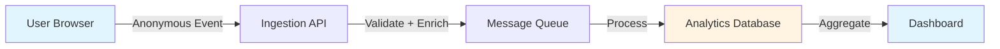

Databuddy is **GDPR compliant by default**. Unlike traditional analytics platforms that require complex consent management, Databuddy's privacy-first architecture means you can start tracking immediately without consent banners, cookie notices, or legal concerns.

## Why Databuddy is GDPR Compliant

### No Personal Data Collection

The GDPR regulates the processing of **personal data** - information that can identify an individual. Databuddy fundamentally does not collect personal data:

<CodeGroup>
```javascript What Databuddy Collects
{
  anonymousId: "anon_a3f8d9c2...",  // Random UUID, not linked to person
  sessionId: "sess_7b2e4f1a...",    // Temporary session identifier
  event: "page_view",                // Event type
  path: "/dashboard",                // Page path
  viewport: "1920x1080",             // Screen size
  language: "en-US",                 // Browser language
  timezone: "America/New_York"       // Timezone
}
```

```javascript What Traditional Analytics Collects
{
  userId: "user@example.com",       // ❌ Personal identifier
  name: "John Smith",               // ❌ Personal information
  ipAddress: "192.168.1.1",         // ❌ Can identify individual
  cookieId: "GA1.2.123456789",      // ❌ Persistent tracking ID
  fingerprint: "a8f3d9c2...",       // ❌ Device fingerprinting
}
```
</CodeGroup>

### Anonymous by Design

Databuddy generates anonymous identifiers that cannot be traced back to individuals:

```typescript Anonymous ID Generation (tracker.ts:167-169)
// From source code: packages/tracker/src/core/tracker.ts
generateAnonymousId(): string {
  return `anon_${generateUUIDv4()}`;
}
```

These IDs are:
- **Random UUIDs** - No connection to real identity
- **Non-persistent** - Can be cleared anytime via localStorage
- **Site-specific** - Not shared across domains
- **Not linkable** - Cannot connect to email, name, or other personal data

### No Cookies Used

Databuddy uses **localStorage** and **sessionStorage** instead of cookies, avoiding GDPR cookie consent requirements:

```typescript Storage Implementation (tracker.ts:145-165)
// Anonymous ID stored in localStorage (persists across sessions)
getOrCreateAnonymousId(): string {
  const storedId = localStorage.getItem("did");
  if (storedId) {
    return storedId;
  }
  
  const newId = this.generateAnonymousId();
  localStorage.setItem("did", newId);
  return newId;
}

// Session ID stored in sessionStorage (expires on browser close)
getOrCreateSessionId(): string {
  const storedId = sessionStorage.getItem("did_session");
  const sessionTimestamp = sessionStorage.getItem("did_session_timestamp");
  
  // Sessions expire after 30 minutes of inactivity
  if (storedId && sessionTimestamp) {
    const sessionAge = Date.now() - parseInt(sessionTimestamp, 10);
    if (sessionAge < 30 * 60 * 1000) {
      return storedId;
    }
  }
  
  return this.generateSessionId();
}
```

**Why this matters for GDPR:**
- localStorage is **not subject to ePrivacy Directive** cookie consent rules
- Data is stored **client-side only** for functionality
- Used for **legitimate technical purpose** (session continuity)
- Not used for **cross-site tracking or profiling**

## GDPR Legal Basis

### Legitimate Interest (Article 6(1)(f))

Databuddy operates under **legitimate interest**, the most common legal basis for web analytics:

<AccordionGroup>
  <Accordion title="Purpose Limitation">
    **What we do:** Collect anonymous usage statistics to improve website functionality and user experience.
    
    **What we don't do:** Create user profiles, behavioral advertising, or cross-site tracking.
  </Accordion>

  <Accordion title="Data Minimization">
    **Minimal data collection:**
    - Only page views, clicks, and performance metrics
    - No names, emails, addresses, or phone numbers
    - No persistent cross-site identifiers
    - IP addresses used only for country/region detection, then discarded
  </Accordion>

  <Accordion title="Balancing Test">
    **Website owner's interest:** Understanding how visitors use their website to improve functionality.
    
    **User's rights:** Privacy and data protection.
    
    **Balance:** Anonymous analytics minimally impact user privacy while providing essential website insights.
  </Accordion>
</AccordionGroup>

### Why Consent is Not Required

Under GDPR Article 6(1)(f), consent is **not required** when:

1. **No personal data is processed** - Databuddy only collects anonymous statistics
2. **Legitimate interest applies** - Website improvement is a recognized legitimate interest
3. **No high privacy risk** - Anonymous analytics pose minimal risk to user rights
4. **Proportionate processing** - Data collection is limited to what's necessary

<Note>
**Legal Opinion:** Multiple European data protection authorities have confirmed that anonymous, non-profiling analytics can operate under legitimate interest without consent. This includes the French CNIL, German DSK, and UK ICO.
</Note>

## Comparison with Traditional Analytics

| Feature | Traditional Analytics (GA4) | Databuddy |
|---------|----------------------------|------------|
| **Personal Data** | Collects user IDs, cookies, may link to Google accounts | None - anonymous only |
| **Consent Required** | Yes - requires cookie banner | No - GDPR compliant by default |
| **Cookie Usage** | Multiple tracking cookies | Zero cookies |
| **Cross-Site Tracking** | Can track across Google properties | Never - site isolation |
| **Data Retention** | 2-14 months configurable | Configurable, anonymous only |
| **Third-Party Sharing** | Data shared with Google | Never - your data stays yours |
| **IP Addresses** | Anonymization optional | Always discarded after geo-lookup |
| **User Identification** | Attempts to identify users | Designed to be anonymous |

## GDPR Rights & Compliance

### Right to Access (Article 15)

**Status:** Not applicable - no personal data stored that can identify individuals.

Because Databuddy only stores anonymous UUIDs (`anon_123...`), there is no way to retrieve "all data about user X" - the system has no concept of who user X is.

### Right to Erasure (Article 17)

**Status:** Users can clear their anonymous ID anytime.

```javascript User-Controlled Data Deletion
// Users can clear their anonymous ID from localStorage
localStorage.removeItem("did");
sessionStorage.removeItem("did_session");

// Or use the opt-out function
window.databuddyOptOut();
```

Implemented in source code at `packages/tracker/src/index.ts:333-336`:

```typescript
localStorage.removeItem("did");
sessionStorage.removeItem("did_session");
sessionStorage.removeItem("did_session_timestamp");
sessionStorage.removeItem("did_session_start");
```

### Right to Object (Article 21)

**Status:** Full opt-out available.

```javascript Opt-Out Implementation (index.ts:404-405)
function databuddyOptOut() {
  localStorage.setItem("databuddy_opt_out", "true");
  localStorage.setItem("databuddy_disabled", "true");
  window.databuddyOptedOut = true;
}
```

Once opted out, the tracker respects this preference:

```typescript Privacy Check (utils.ts:47-48)
export function isOptedOut(): boolean {
  return (
    localStorage.getItem("databuddy_opt_out") === "true" ||
    localStorage.getItem("databuddy_disabled") === "true" ||
    window.databuddyOptedOut === true
  );
}
```

Tested in `packages/tracker/tests/privacy.spec.ts:18-94`.

### Right to Data Portability (Article 20)

**Status:** Not applicable - only anonymous aggregated statistics exist, not individual user data.

### Right to Rectification (Article 16)

**Status:** Not applicable - no personal data to correct.

## Privacy by Design (Article 25)

Databuddy embodies **Privacy by Design and by Default** principles:

### 1. Data Minimization

```typescript Minimal Context Collection (tracker.ts:294-324)
getBaseContext(): EventContext {
  return {
    path: window.location.pathname,
    title: document.title,
    referrer: document.referrer || "direct",
    viewport_size: width && height ? `${width}x${height}` : undefined,
    timezone: Intl.DateTimeFormat().resolvedOptions().timeZone,
    language: navigator.language,
    // No personal identifiers
    // No persistent cookies
    // No device fingerprinting
  };
}
```

### 2. Privacy by Default

- **No tracking without setup** - Explicit clientId required
- **Bot detection** - Automated traffic filtered out
- **localhost disabled** - No development tracking by default
- **Sampling support** - Can reduce data collection volume

```typescript Privacy Defaults (tracker.ts:57-75)
const defaultOptions = {
  disabled: false,
  trackPerformance: true,
  samplingRate: 1.0,
  enableBatching: true,
  // Conservative defaults that respect privacy
};
```

### 3. Purpose Limitation

Data is used **only for website analytics**, never for:
- Behavioral advertising
- Cross-site tracking  
- User profiling
- Third-party sharing
- Email marketing

## Data Processing Transparency

### What Happens to IP Addresses

<Steps>
  <Step title="IP Reception">
    IP address received with analytics request
  </Step>
  <Step title="Geo-Lookup">
    IP used to determine country and region only
  </Step>
  <Step title="Immediate Discard">
    IP address discarded - never stored in database
  </Step>
  <Step title="Storage">
    Only country/region stored (e.g., "United States, California")
  </Step>
</Steps>

Implemented in ingestion service: `rust/ingestion/MIGRATION.mdx:29` indicates GeoIP enrichment adds only `country`, `region`, `city` before discarding IP.

### Data Flow Architecture



**Privacy checkpoints:**
1. **Browser:** Only anonymous data sent
2. **Ingestion:** IP discarded after geo-lookup
3. **Storage:** Only aggregated, anonymous data
4. **Dashboard:** No individual user identification possible

## Implementation Guide

### 1. Basic Setup (No Consent Needed)

```tsx app/layout.tsx
import { Databuddy } from "@databuddy/react";

export default function RootLayout({ children }) {
  return (
    <html>
      <body>
        {/* No consent banner needed - GDPR compliant by default */}
        <Databuddy clientId="your-client-id" />
        {children}
      </body>
    </html>
  );
}
```

### 2. Optional Privacy Notice

While not legally required, you can provide transparency:

```tsx components/PrivacyNotice.tsx
export function PrivacyNotice() {
  return (
    <div className="text-sm text-gray-600">
      <p>
        We use anonymous analytics to understand how visitors use our site.
        No personal information is collected, and no cookies are used.
      </p>
      <a href="/privacy-policy" className="underline">
        Learn more about our privacy practices
      </a>
    </div>
  );
}
```

### 3. Optional Opt-Out

Provide extra control to privacy-conscious users:

```tsx components/AnalyticsOptOut.tsx
"use client";
import { useState, useEffect } from "react";

export function AnalyticsOptOut() {
  const [optedOut, setOptedOut] = useState(false);

  useEffect(() => {
    setOptedOut(localStorage.getItem("databuddy_opt_out") === "true");
  }, []);

  const handleOptOut = () => {
    if (typeof window !== "undefined" && window.databuddyOptOut) {
      window.databuddyOptOut();
      setOptedOut(true);
    }
  };

  const handleOptIn = () => {
    localStorage.removeItem("databuddy_opt_out");
    localStorage.removeItem("databuddy_disabled");
    setOptedOut(false);
    window.location.reload();
  };

  return (
    <div>
      <h3>Analytics Preferences</h3>
      <p>
        Status: {optedOut ? "Opted out" : "Active"}
      </p>
      {optedOut ? (
        <button onClick={handleOptIn}>Enable Analytics</button>
      ) : (
        <button onClick={handleOptOut}>Disable Analytics</button>
      )}
    </div>
  );
}
```

## Privacy Policy Template

Recommended disclosure for your privacy policy:

<Accordion title="Sample Privacy Policy Language">
```markdown
### Website Analytics

We use Databuddy to collect anonymous website usage statistics. This helps us
understand how visitors interact with our site so we can improve it.

**What we collect:**
- Anonymous page views and navigation patterns
- Browser type and screen size
- Country and region (derived from IP address, which is immediately discarded)
- Performance metrics (page load times)

**What we don't collect:**
- Names, email addresses, or other personal information
- Precise location or full IP addresses
- Cross-site browsing behavior
- Any information that could identify you as an individual

**Legal basis:** Legitimate interest (GDPR Article 6(1)(f)) for improving
website functionality and user experience.

**Data retention:** Anonymous analytics data is retained for [X months/years]
for statistical analysis.

**Your rights:** You can opt out of analytics tracking at any time by visiting
[link to opt-out page].

**Third parties:** Analytics data is processed by Databuddy. No data is shared
with advertising networks or other third parties.
```
</Accordion>

## Regulatory Compliance

### European Union - GDPR

<Check>**Compliant by default** - No consent required</Check>

**Basis:** Legitimate interest under Article 6(1)(f)

**Reasoning:**
- No personal data processing
- No behavioral profiling
- Minimal privacy impact
- Proportionate to purpose

### California - CCPA

<Check>**Compliant** - No sale of personal information</Check>

**Basis:** Anonymous data not considered "personal information" under CCPA

**CCPA Definition:** Personal information must "identify, relate to, describe, 
or be capable of being associated with" a particular consumer. Random UUIDs 
do not meet this definition.

### UK - UK GDPR & PECR

<Check>**Compliant** - No cookies used for tracking</Check>

**ICO Guidance:** Anonymous analytics without cookies or personal data 
processing can operate under legitimate interest.

### Brazil - LGPD

<Check>**Compliant** - Anonymous data processing</Check>

**Basis:** Legitimate interest (Article 7, X) and anonymous data exceptions

## Frequently Asked Questions

<AccordionGroup>
  <Accordion title="Do I need a cookie banner with Databuddy?">
    **No.** Databuddy doesn't use cookies for tracking, only localStorage for anonymous IDs. Cookie consent laws (ePrivacy Directive) don't apply to non-cookie local storage used for legitimate technical purposes.
  </Accordion>

  <Accordion title="Do I need to update my privacy policy?">
    **Yes.** You should disclose that you use anonymous analytics, even though it's not personal data. Transparency is good practice.
  </Accordion>

  <Accordion title="Can users request their data?">
    **No data to request.** Databuddy only stores anonymous UUIDs that cannot be linked to individuals. There's no way to retrieve "data about user X" because the system has no concept of who users are.
  </Accordion>

  <Accordion title="What about bot traffic and GDPR?">
    Databuddy automatically detects and filters bot traffic. Bots don't have GDPR rights as they're not natural persons.
  </Accordion>

  <Accordion title="Is localStorage subject to ePrivacy cookie rules?">
    **No.** The ePrivacy Directive specifically regulates cookies and similar technologies used for tracking. localStorage used for legitimate technical functionality (session continuity) is not subject to consent requirements.
  </Accordion>

  <Accordion title="What if a user asks to delete their data?">
    Provide instructions for clearing localStorage:
    ```javascript
    localStorage.removeItem("did");
    sessionStorage.removeItem("did_session");
    ```
    
    However, emphasize that this is an anonymous ID that contains no personal information and cannot be linked to them as an individual.
  </Accordion>
</AccordionGroup>

## Conclusion

Databuddy is designed from the ground up to be GDPR compliant:

- **No personal data** - Only anonymous, aggregated statistics
- **No cookies** - Uses localStorage for technical functionality
- **No consent required** - Operates under legitimate interest
- **Privacy by design** - Built-in privacy protections
- **User control** - Optional opt-out available
- **Transparency** - Open about what's collected and why

You can start using Databuddy immediately without legal concerns, consent banners, or cookie notices. Just add the tracker and start getting insights.

<Card title="Ready to get started?" icon="rocket" href="/quickstart">
  Set up privacy-first analytics in under 5 minutes
</Card>
