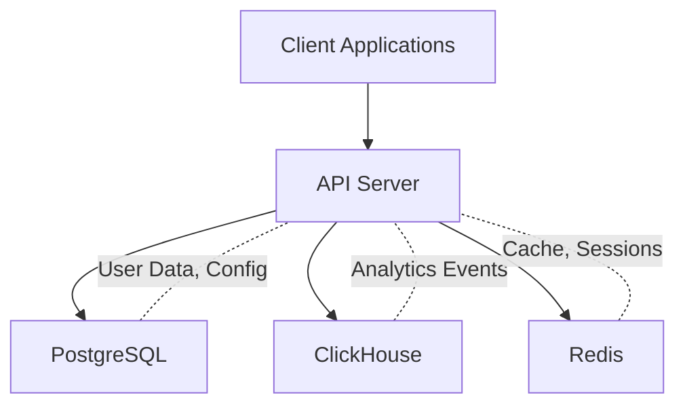

## Why Self-Host Databuddy?

Databuddy is a privacy-first analytics platform built with modern web technologies. While we offer a hosted solution, self-hosting gives you complete control over your data and infrastructure.

### Benefits of Self-Hosting

**Complete Data Ownership**

When you self-host Databuddy, all analytics data stays on your infrastructure. You have full control over:

- Where your data is stored (on-premise or your cloud provider)
- Data retention policies
- Backup and disaster recovery strategies
- Database access and query capabilities

**Privacy & Compliance**

Self-hosting helps you meet strict data residency requirements:

- Keep data within specific geographic regions
- Meet GDPR, CCPA, and other regulatory requirements
- Avoid third-party data processing agreements
- Full audit trail of data access

**Cost Optimization**

For high-volume analytics workloads, self-hosting can be more economical:

- No per-event pricing
- Optimize infrastructure costs for your specific usage patterns
- Scale ClickHouse and PostgreSQL independently
- Use existing infrastructure and credits

**Customization & Integration**

Self-hosting allows deep customization:

- Modify analytics schemas to track custom metrics
- Direct database access for custom queries and reports
- Integrate with internal tools and workflows
- Custom authentication and authorization

## When to Self-Host

### Ideal Use Cases

<CardGroup cols={2}>
  <Card title="Enterprise Deployments" icon="building">
    Organizations with strict data governance requirements and dedicated DevOps teams.
  </Card>
  
  <Card title="High-Volume Analytics" icon="chart-line">
    Applications tracking millions of events per day where infrastructure costs matter.
  </Card>
  
  <Card title="Custom Infrastructure" icon="server">
    Teams with existing Kubernetes, PostgreSQL, or ClickHouse deployments.
  </Card>
  
  <Card title="Data Residency" icon="location-dot">
    Applications requiring data to stay in specific regions or on-premise.
  </Card>
</CardGroup>

### When Cloud Hosting Makes Sense

Consider our managed cloud offering if you:

- Want zero infrastructure management overhead
- Need to get started quickly without DevOps setup
- Have variable traffic patterns that benefit from auto-scaling
- Prefer predictable pricing without infrastructure complexity

## Architecture Overview

Databuddy's self-hosted architecture consists of:

### Core Components

**PostgreSQL 17**
- User accounts and authentication
- Website configurations
- Organizations and teams
- API keys and permissions

**ClickHouse 25.5+**
- Real-time analytics events
- Web vitals metrics
- Error tracking
- Custom events and revenue data
- AI usage observability

**Redis 7**
- Session management
- Query result caching
- Rate limiting

**Node.js 20+ / Bun 1.3+**
- API server (Elysia)
- Dashboard (Next.js 16)
- Background jobs

## License

Databuddy is licensed under AGPL-3.0, which means:

- You can self-host and modify Databuddy freely
- If you modify and distribute Databuddy, you must share your changes
- Network use (API access) triggers AGPL distribution requirements
- Commercial support and enterprise licenses available

See the [LICENSE](https://github.com/databuddy-analytics/Databuddy/blob/main/LICENSE) file for full details.

## Next Steps

<CardGroup cols={2}>
  <Card title="System Requirements" icon="list-check" href="/self-hosting/requirements">
    Check hardware and software requirements
  </Card>
  
  <Card title="Docker Setup" icon="docker" href="/self-hosting/docker">
    Get started with Docker Compose
  </Card>
  
  <Card title="Environment Variables" icon="key" href="/self-hosting/environment-variables">
    Configure your deployment
  </Card>
  
  <Card title="Database Setup" icon="database" href="/self-hosting/database-setup">
    Initialize PostgreSQL and ClickHouse
  </Card>
</CardGroup>

## Support

Need help with self-hosting?

- [GitHub Issues](https://github.com/databuddy-analytics/Databuddy/issues) - Bug reports and feature requests
- [Discord Community](https://discord.gg/JTk7a38tCZ) - Community support and discussions
- [Email Support](mailto:support@databuddy.cc) - Direct assistance for self-hosting
